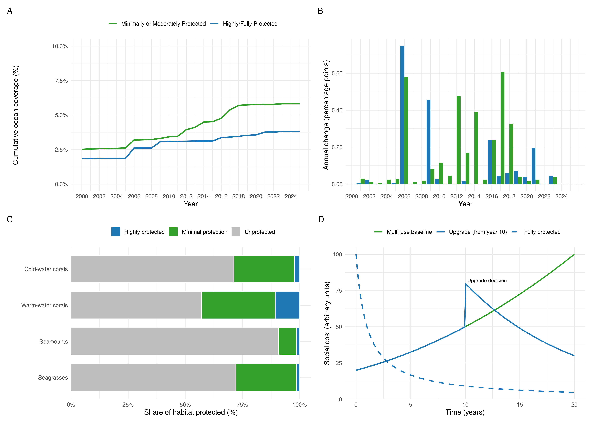
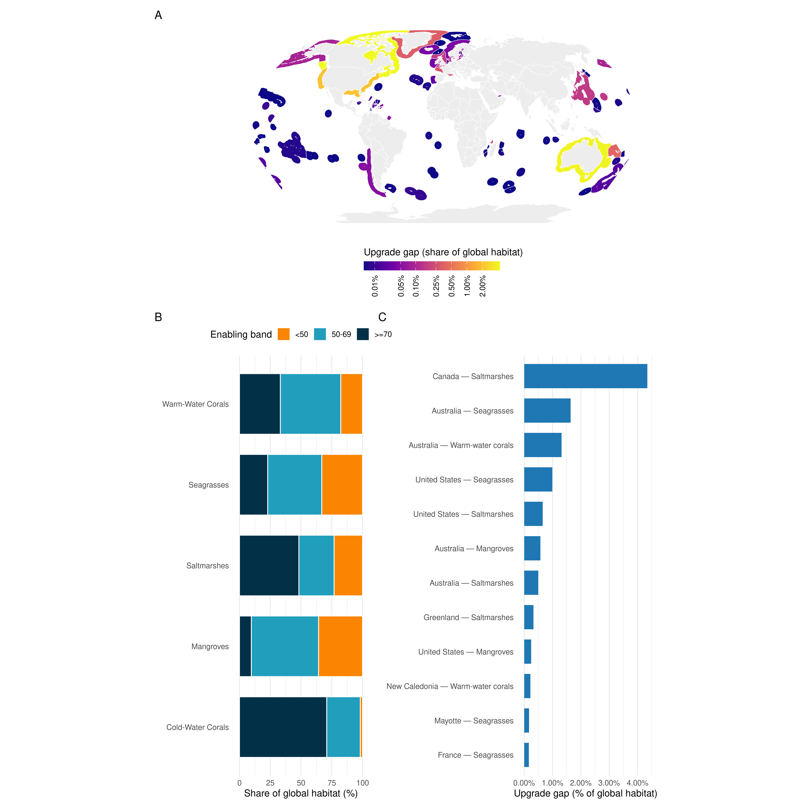

**Ocean Protection Is Stalling—and How High-Capacity Nations Can Help Regain Momentum**

Fabio Favoretto^1^\*, Joy A. Kumagai^2^, Catalina López-Sagástegui^3^, Deirdre Brannigan^4^, Alex Driedger^4^, Jennifer Sletten^4^, Claire Colegrove^4^, Timothe Vincent^4^, Virgil Zetterlind^4^, Paolo Guidetti^5^, Octavio Aburto Oropeza^1^

^1^ Scripps Institution of Oceanography, University of California San Diego, 8885 Biological Grade, La Jolla, CA 92037, USA  
^2^ Hopkins Marine Station, Department of Biology, Stanford University, Pacific Grove, CA 93950, USA  
^3^ Gulf of California Marine Program, Institute of the Americas, 10111 North Torrey Pines Road, La Jolla, CA 92037, USA  
^4^ ProtectedSeas, Anthropocene Institute, 2475 Hanover Street, Palo Alto, CA 94304, USA  
^5^ Department of Integrative Marine Ecology, Stazione Zoologica Anton Dohrn, Genoa Marine Centre, Villa del Principe, Genoa, Italy

\*Lead contact and correspondence: fabio@gocmarineprogram.org

# SCIENCE FOR SOCIETY

The world has pledged to protect 30% of the ocean by 2030, yet meaningful protection is not increasing at the required pace. Fully protected MPAs, which prohibit any extraction, currently cover just 3.8% of the ocean and have grown by only ~0.05 percentage points per year since 2018. Minimally protected MPAs account for 5.8%. Our analysis shows that the largest opportunities to accelerate protection lie with a small group of high-capacity nations—those with strong governance, robust institutions, and economic capacity for conservation—whose vast marine estates remain predominantly minimally protected. Upgrading minimally protected MPAs in these jurisdictions offers a path to ecological gains and would demonstrate decisive leadership on 30×30. International finance and partnerships must simultaneously strengthen enabling conditions—a composite index of governance quality, rule of law, and blue economy readiness—in lower-scoring nations to build their capacity for effective protection. Decisive action from this limited cohort of high-capacity countries could catalyze progress toward healthier oceans and more resilient coastal societies globally.

# HIGHLIGHTS

- Fully protected MPAs remain stuck at 3.8% of the ocean, with annual gains below 0.05%;
- The largest opportunities to expand fully protected areas lie in high-capacity countries;
- Upgrading minimally protected MPAs in these jurisdictions can have a large impact on global habitat protection;
- Leadership from high-capacity countries can demonstrate decisive action on 30×30.

# [SUMMARY]{.mark}

Global marine conservation is at a critical juncture, as nations strive to halt biodiversity loss and ensure the sustainability of ocean ecosystems. The post-2020 Kunming–Montreal Global Biodiversity Framework commits countries to protect 30% of the ocean by 2030 (the 30×30 target). Fully protected marine protected areas (MPAs)—those prohibiting extractive activities—are known to deliver the strongest ecological outcomes. Despite this global commitment, meaningful progress has stalled. Only 3.8% of the ocean is currently under full protection, and annual increases have slowed to less than 0.05 percentage points since 2018. Most new MPAs are minimally protected, allowing continued extraction in heavily exploited coastal regions. We show that the greatest potential for expanding fully protected coverage lies with a small group of high-capacity nations whose domestic waters remain largely minimally protected, despite strong governance, robust institutions, and enforcement capacity. By overlaying habitat extent, current protection levels, and enabling conditions—a composite index combining governance quality, rule of law, and blue economy readiness derived from Cisneros-Montemayor et al.^12^—we identify key upgrade opportunities concentrated in wealthy states, including France, the United Kingdom, the United States, Canada, Australia, Greenland, and New Caledonia. A large share of mapped coral, mangrove, seagrass, and saltmarsh extent falls within countries scoring ≥50 on enabling conditions, yet full protection in these areas remains minimal. Many of these opportunities occur in overseas territories, where nations retain jurisdiction over globally significant ecosystems but have not yet elevated protection levels. We provide a governance-focused roadmap that prioritizes these upgrade-ready jurisdictions and outlines how finance, enforcement, and community partnerships can strengthen enabling conditions elsewhere. Decisive action by this limited cohort of high-capacity nations would demonstrate global conservation leadership, unlock immediate ecological gains, and create political momentum for broader international participation toward achieving the 30×30 target.

# KEYWORDS

Marine protected areas, ocean governance, enabling conditions, ProtectedSeas, habitat protection, conservation finance, blue economy, 30×30 target, biodiversity, climate resilience

# [INTRODUCTION]{.mark}

Global momentum for marine conservation has led to increasing commitments to ocean protection, including the widely endorsed post-2020 Kunming-Montreal Global Biodiversity Framework, which aims to protect 30% of the ocean by 2030 (30×30)^1^. This target builds upon previous efforts such as the Aichi Target 11, which sought 10% protection by 2020 but fell short of delivering meaningful outcomes^2,3^. While area-based targets remain central, there is now broader recognition that effective conservation requires attention to ecological function, social equity, and enforcement capacity—not just spatial coverage^1,4–6^.

Global assessments based on the World Database on Protected Areas (WDPA) and The MPA atlas have shown that most MPAs offer limited ecological benefits due to weak implementation and management^7,8^. Recent socioeconomic modeling suggests that expansion of new MPAs into jurisdictions lacking strong governance is unlikely to succeed^9^. These findings point toward a critical shift in strategy: strengthening regulations within existing Marine Protected Areas (MPAs) may offer a more realistic near-term pathway than continued large-scale expansion^7,13,14^. By targeting jurisdictions that already possess strong enabling conditions—measured through governance quality, institutional capacity, and economic readiness for conservation—upgrades can unlock immediate ecological gains while addressing the social transitions required to build public support^9,12,36,37^.

Our analysis focuses on MPAs rather than Other Effective area-based Conservation Measures (OECMs) because MPAs provide the clearest statutory mechanism for governments to tighten regulations within their Exclusive Economic Zones (EEZs). While high-quality OECMs and community-led stewardship models exist and should be encouraged^8^, their standards remain broad and unevenly applied. Evidence demonstrates that sustained ecological recovery requires strict limits on extraction^19–21^; without enforceable no-take standards, there is risk of diluting conservation targets. Similarly, while the 2023 Agreement under UNCLOS on Biodiversity Beyond National Jurisdiction (BBNJ) is an historic milestone^47^, the governance and financing mechanisms required to activate high-seas protections are still being negotiated. Countries can act immediately within their EEZs by upgrading existing MPAs, building a track record of effective protection while BBNJ institutions mature.

We rely on UNEP-WCMC habitat maps because they provide globally consistent, observation-based layers—not statistical models—ensuring that habitat presence aligns with regulatory boundaries^18^. Even these curated datasets exhibit sampling biases toward tropical and subtropical ecosystems; temperate kelp forests, rocky reefs, and polar habitats remain underrepresented due to the absence of comparable global products^49^. We address this limitation explicitly in our methods and discuss the need for expanded habitat coverage as standardized datasets emerge.

Our analysis builds upon previous FAIR methods^10,18^ and advances the field in four key ways:

   1. We use regulatory data from the ProtectedSeas initiative^11^, which provides detailed, rule-based classifications of global MPA protection levels rather than relying solely on IUCN categories.
   2. We conduct a temporal analysis of global MPA expansion from 2000 to 2025, distinguishing between minimally and fully protected areas to reveal stalling trends in high-quality protection.
   3. We incorporate critical coastal habitat distributions (corals, mangroves, seagrasses, saltmarshes) to quantify where upgrade opportunities align with biodiversity priorities.
   4. We identify upgrade priorities by overlaying habitat extent, protection levels, and enabling conditions^12^—revealing that countries with strong governance capacity hold the largest opportunities to advance fully protected coverage, particularly across their overseas territories.

This upgrade-focused strategy operates in parallel with the establishment of new MPAs and the recognition of high-quality OECMs^8^. By demonstrating where governments can immediately strengthen existing statutory protections, we provide a practical pathway to accelerate progress toward 30×30 while longer-term efforts to expand coverage and improve BBNJ implementation continue.

# [RESULTS]{.mark}

## Stalling trends in MPA expansion

Figure 1A shows that fully protected MPAs cover 3.81% of the ocean in 2025, while minimally or moderately protected MPAs contribute 5.81%. Annual gains in fully protected MPAs have slipped below 0.05 percentage points since 2018 (Figure 1B), indicating that the recent surge in MPA declarations has not translated into stricter regulations. Habitat status mirrors this pattern. Across warm- and cold-water corals, mangroves, seagrasses, and saltmarshes, fully protected coverage remains a small fraction of total extent and has improved only marginally since our previous assessment^18^ (Figure 1C). Without regulatory upgrades, continued expansion of minimally protected areas will increase spatial coverage while delivering limited ecological benefits.

## Coastal habitats remain exposed in high-capacity nations

This stalling of high-quality protection is particularly consequential because mapped coastal habitats occur predominantly in countries that already possess the governance and financial capacity to manage them effectively. Forty-two percent of global habitat extent lies in the 50–69 enabling band, 30% in ≥70, and only 28% in the <50 band (Figure 2B). Blue-carbon ecosystems show the strongest concentration: 55% of mangrove area and 44% of seagrass area are located in countries scoring 50–69, while more than a third of warm-water coral and saltmarsh extent also sits in medium- or high-enabling jurisdictions.

Yet these same nations still rely on weak regulation. Within enabling ≥70 jurisdictions, fully protected MPAs secure just 14,000 km² of warm-water corals, 2,200 km² of seagrasses, and 41 km² of saltmarshes, compared with tens of thousands of square kilometres that remain minimally protected. The 50–69 band follows the same pattern: 36,700 km² of mangroves, 33,900 km² of seagrasses, and 31,300 km² of saltmarshes persist under minimal rules. Low-enabling countries collectively provide only 41 km² of fully protected coral reefs and 341 km² of seagrasses, underscoring that the biggest ecological dividends from stronger regulations now sit with high-capacity states. Altogether, ≥70 countries maintain 10.18 million km² (74%) of the world's fully protected MPA area, and the top ten sovereign territories steward 11.97 million km² (87%), yet those same jurisdictions hold 109,000 km² (39%) of the remaining upgrade gap. For nations with extensive overseas territories—such as France, the United Kingdom, and the United States—these figures reflect a leadership responsibility that stretches well beyond domestic coastlines. Their policy choices therefore drive both today’s successes and tomorrow’s potential gains.

The social dynamics captured in Figure 1D help explain why upgrades face political resistance even in well-governed countries. Fully protected MPAs impose higher short-term costs because extractive uses are curtailed immediately, yet evidence shows they deliver larger long-term ecological and economic gains through spillover, tourism, and climate resilience^19–22,33–35^. Minimally protected areas may spread costs more thinly, but they also demand continuous management effort and can erode trust when expected benefits do not materialize^14,25,29,36^. Successful upgrades require participatory planning, livelihood transitions, and transparent monitoring so that affected communities can assess trade-offs and share in long-term gains^24,37,38^. Without these social processes, governments tend to favor low-regulation designations that increase spatial coverage while delivering uncertain ecological outcomes.

## Upgrade opportunities align with enabling conditions

Figure 2A–C highlight where governance capacity and habitat exposure overlap. Panel A filters on jurisdictions with enabling-condition scores ≥70, so mid-scoring states remain in panels B and C but are not mapped. Canada’s saltmarsh MPAs account for the single largest upgrade gap (36,900 km² of minimally protected area compared with just 40 km² fully protected), followed by Australia’s seagrass and warm-water coral MPAs (13,900 km² and 11,200 km² gaps respectively) and the United States’ seagrass and saltmarsh estates (8,400 km² and 5,500 km² gaps). Greenland (Denmark) and France’s New Caledonia also appear among the top high-enabling jurisdictions whose upgraded protection would immediately secure globally significant habitats. Panel C ranks these opportunities explicitly, underscoring that the largest upgrade dividends now sit with countries that already possess robust governance and finance systems.

Closing these gaps requires differentiated strategies. High-enabling countries can deliver measurable biodiversity and climate gains by converting minimally protected MPAs into fully protected refuges—particularly for blue-carbon ecosystems such as mangroves, saltmarshes, and seagrasses, where tens of thousands of square kilometres remain under weak regulation. Because the top ten sovereign territories already control 87% (11.97 million km²) of existing fully protected coverage and hold 39% of the global upgrade gap, commitments from this small cohort would demonstrably shift global trajectories. Visible upgrades from these jurisdictions—including their overseas territories—would signal substantive action on 30×30 and provide evidence that strengthening regulations is politically and economically feasible. Lower-enabling states require parallel investments in enforcement capacity, livelihood transitions, and co-management institutions before regulatory upgrades become viable, but the immediate opportunity lies with jurisdictions already equipped to act. This prioritization aligns with socio-environmental modeling linking MPA success to governance quality and economic diversification^9^, and provides a practical framework for directing finance, technology transfer, and community partnerships.

# [DISCUSSION]{.mark}

Upgrades complement rather than replace the establishment of new MPAs and recognition of high-quality OECMs; they unlock immediate conservation gains while broader spatial planning, new designations, and BBNJ implementation advance in parallel^44,47^. Empirical evidence shows that some countries have strengthened MPA regulations without harming industrial fishing sectors^27^, demonstrating that regulatory upgrades are feasible where enabling conditions are strong. Because the top ten sovereign territories already steward 87% (11.97 million km²) of the world's fully protected MPA area, targeted action by this limited cohort can measurably shift global outcomes. Progress in these jurisdictions—including responsible stewardship of their overseas territories—would provide evidence of conservation leadership and establish precedents for nations with lower governance capacity. By mapping where minimally protected habitat overlaps with high institutional capacity, our analysis identifies specific jurisdictions where governments, Indigenous and community partners, and funders can prioritize action.

International cooperation and finance mechanisms can support these upgrades. Investments in ranger programs, satellite and shore-based surveillance^27,28,39^, and participatory co-management structures^40^ strengthen enforcement where local capacity is limited. Financial instruments—including blue bonds, debt-for-nature swaps, and benefit-sharing arrangements—can help align the costs and benefits of stricter protection^41,42^. Evidence suggests that where communities participate in governance and share economic returns from ecotourism or fisheries spillover, compliance increases and the risk of ineffective "paper parks" declines^14,43^. The 2025 UN Ocean Conference "Pact for the Ocean" calls for accelerated delivery of fully protected MPAs^48^; the spatial priorities identified here provide concrete targets for directing that support.
Our analysis focuses on Exclusive Economic Zones because they provide governments with immediate statutory authority to strengthen MPA regulations. OECMs were excluded from the quantitative analysis because many lack the standardized regulatory frameworks needed for comparable global assessment, though they continue to deliver locally governed conservation outcomes. While the 2023 Agreement under UNCLOS on Biodiversity Beyond National Jurisdiction creates a pathway for future high-seas protections^47^, operational mechanisms are still emerging; the jurisdictions identified here can advance measurable progress within their national waters while BBNJ institutions develop.

Transparent monitoring and reporting remain essential for tracking outcomes. Upgrading existing MPAs—particularly those overlapping with critical habitats in high-enabling jurisdictions—provides a tractable pathway that aligns with the Convention on Biological Diversity's emphasis on ecological function, social equity, and adaptive governance. Achieving 30% protection of territorial seas alone will require protecting an additional 1.68 million km² (approximately 188,000 coastal MPAs at an average size of 10 km²) by 2030^44^. A strategy prioritizing regulatory quality, supported by targeted new designations and high-performing OECMs, offers a more effective approach than continued expansion of minimally protected areas^1,7,8,47^.

## Limitations of the study

Habitat analyses draw on UNEP-WCMC mapped layers that emphasise tropical and subtropical ecosystems; comparable, high-resolution products for temperate kelp forests, rocky reefs, and polar habitats remain unavailable, constraining our ability to assess upgrade potential in those regions^49^. Enabling-condition scores are aggregated at national scales, meaning sub-national governance variation is not fully captured, and we do not directly observe on-the-ground enforcement capacity or compliance outcomes. These constraints likely make our upgrade estimates conservative, underscoring the need for continued investment in open, standardised monitoring of MPA regulations, habitat coverage, and institutional performance.

*Figure 1. Global MPA progress has stalled. (A) Cumulative share of the ocean under minimally/moderately protected (LFP 1–3; green) and highly/fully protected (LFP 4–5; blue) MPAs from 2000–2025. (B) Annual change in MPA protection (percentage points). (C) 2025 habitat coverage for warm- and cold-water corals, seagrasses, saltmarshes, and mangroves partitioned by protection level. (D) Conceptual social-cost trajectories contrasting minimally protected MPAs (green) and highly/fully protected MPAs (blue).* 

*Figure 2. High-capacity jurisdictions dominate upgrade potential. (A) World map highlighting countries with enabling scores ≥70; colours denote each EEZ’s share of global coastal-habitat extent that remains minimally protected (ocean areas only) and are rendered with a pseudo-logarithmic colour scale (σ = 0.01) to preserve contrast across orders of magnitude. Countries scoring below that threshold (e.g., Italy, enabling score 66.8) are omitted from the map, while territories lacking enabling-condition data are shown in grey. (B) Share of global habitat extent positioned in each enabling band, showing that most mapped habitats lie in medium/high-capacity states. (C) Top high-enabling country–habitat combinations ranked by upgrade gap, expressed as the share of global habitat that would shift from minimal to full protection if upgraded.*

# STAR★Methods

## Key resources table

| REAGENT or RESOURCE | SOURCE | IDENTIFIER |
| --- | --- | --- |
| ProtectedSeas Navigator (release 03-28-25) | ProtectedSeas Navigator portal | https://www.protectedseas.net/navigator |
| UNEP-WCMC global habitat layers (Mangroves v3, Seagrasses v7.1, Saltmarshes, Coral Reefs, Cold-water Corals) | UNEP-WCMC Ocean Data Viewer | https://data.unep-wcmc.org |
| Enabling conditions for an equitable and sustainable blue economy dataset | Cisneros-Montemayor et al. (2021) Dryad repository | https://doi.org/10.5061/dryad.63xsj3v1h |
| Processed raster outputs (1 km MPAs and habitats) | This study | https://github.com/Fabbiologia/mpa_momentum |
| Reproducible analysis repository and supplementary code | This study | https://github.com/Fabbiologia/mpa_momentum |
| R (v4.3 or later) with `targets`, `tarchetypes`, `sf`, `terra`, `ggplot2`, `rmarkdown`, and dependencies | CRAN | https://cran.r-project.org |
| Python environment with `geopandas`, `rasterio`, `numpy`, `shapely` | PyPI | https://pypi.org/project/geopandas/ |

## Resource availability

### Lead contact
Further information and requests for resources should be directed to the lead author (Fabio Favoretto; fabio@gocmarineprogram.org).

### Materials availability
This study did not generate new physical materials or reagents.

### Data and code availability
- ProtectedSeas Navigator data (release 03-28-25) are available for research via the ProtectedSeas portal (https://www.protectedseas.net/navigator).
- UNEP-WCMC habitat shapefiles (Global Mangrove Watch v3, Global Seagrasses v7.1, Global Saltmarshes, Global Coral Reefs, Global Cold-water Corals) can be downloaded from the Ocean Data Viewer^49^.
- Enabling-condition scores are accessible through the Dryad repository associated with Cisneros-Montemayor et al. (2021).
- All processed rasters, tables, and figure-ready outputs produced in this project are distributed in the accompanying repository https://github.com/Fabbiologia/mpa_momentum (`data/processed/`, `outputs/`). Code to reproduce the analysis is available under `scripts/` (R) and `scripts_py/` (Python).
- The full {targets}-based analysis pipeline, including scripts, configuration files, and processed datasets required to regenerate every figure and table, is maintained at https://github.com/Fabbiologia/mpa_momentum and will be deposited as supplementary code and data (with a mirrored Zenodo archive) alongside the revised submission for long-term access.

## Method details

### Marine Protected Area data processing

We analysed global marine protection using the 03-28-2025 ProtectedSeas Navigator release, which provides rule-based classifications for Marine Protected Areas (category_name == "Marine Protected Area") and other domestic tools. Following established practice^8,45^, we classified Level of Fishing Protection (LFP) scores 1–3 as “minimally/moderately protected” and LFP 4–5 as “highly/fully protected.” After harmonising attributes and dissolving parent–child polygons, we generated two 1 km Mollweide rasters (EPSG:6933): one for MPAs (including high-seas provisions) and a second for all other measures after excluding Fisheries Management Areas and “High Seas / International” records. Establishment year metadata were used to create cumulative annual snapshots from 2000–2025 for each raster, enabling consistent trend comparisons between MPAs and other measures.

### MPA statistics

Yearly global coverage (Figure 1A–B) was derived from the MPA raster by summing LFP counts, converting 1 km cells to square kilometres, and calculating cumulative and annual percentage change relative to the global ocean area (361,000,000 km²). For country-level summaries we overlaid the MPA raster (and, where relevant, the non-MPA raster) with the EEZ_Land_v3_202030 dataset, counting minimally/moderately and highly/fully protected cells within each sovereign EEZ. These values were subsequently joined to enabling-condition scores to produce Figure 2A. To focus the map on high-capacity jurisdictions we retained territories scoring ≥70, estimated each upgrade gap as the minimally protected minus fully protected habitat area, and normalised those gaps by the global coastal-habitat total generated by the raster workflow so that shading represents each EEZ’s share of globally exposed habitat. Jurisdictions below the threshold remain in the tabular summaries informing panels B and C but are masked from the map. EEZ geometries were reprojected to the Robinson coordinate system, had landmasses removed using the Natural Earth 1:50m land layer, and were clipped to their ocean portions prior to plotting. The resulting percentages were rendered with a pseudo-logarithmic colour scale (σ = 0.01) to maintain contrast among both small and large upgrade opportunities. Raster convergence was validated against polygonal area totals to ensure consistency of high- and low-protection estimates across sources.

### Marine habitat protection assessment

We analyzed protection status for five critical marine habitats: - Mangroves - Seagrasses - Coral reefs - Saltmarshes - Cold-water corals. Here we used the same code and methods from Kumagai et al^18^, but adapting the workflow to ProtectedSeas data instead of the World Database on Protected Areas (WDPA) that was used by Kumagai. Each habitat’s global distribution was obtained from the UN Environment Programme - World Conservation Monitoring Centre (UNEP-WCMC) which provides global distribution data for various marine and terrestrial habitats. Habitat polygons were rasterized to 1km resolution. Some habitats distributions were represented by points instead of polygons, in that case both point and polygon data were incorporated, with 1km area buffering applied to point data based on habitat characteristics^18^. We then quantified habitat protection by overlaying habitat distributions with MPA boundaries for each year, generating time series of protection status. This allowed us to track changes in the proportion of each habitat under various levels of protection over time.

The UNEP-WCMC datasets we use are mapped, observational products (not statistical models), ensuring that habitat presence aligns with regulatory boundaries for downstream intersection with ProtectedSeas MPAs. Following Kumagai et al. (2021), we store the raw shapefiles in `data/raw/habitats_original/`, reproject them to the equal-area EPSG:6933 CRS, buffer point features to 1 km² circles, and rasterise each habitat at 1 km resolution through `scripts_py/02_habitat_raster_analysis.py`. The workflow ingests the Global Mangrove Watch v3,
Global Distribution of Seagrasses v7.1, Global Saltmarshes, Global Coral Reefs, and Global Cold-water Corals layers available from the UNEP-WCMC Ocean Data Viewer^49^. The resulting rasters and the accompanying `habitat_raster_summary.csv` capture pixel counts and total area (km²) so the workflow remains FAIR and reproducible.

### Enabling conditions analysis

We summarised the Cisneros-Montemayor et al.^12^ enabling-condition dataset by sovereign territory, trimmed leading and trailing whitespace, and recoded Antarctica as missing to reflect its treaty governance. Enabling bands were defined as <50, 50–69, ≥70, and “Missing.” Unless otherwise noted (e.g., when reporting raw totals), shares and visualisations exclude the “Missing” band so that countries lacking enabling-condition data do not influence interpretation. These scores were joined to the country-level MPA summaries and to habitat-area tables described above to quantify the distribution of fully and minimally protected ecosystems across governance gradients (Figure 2). Habitat totals were calculated for five coastal ecosystems (warm- and cold-water corals, mangroves, seagrasses, and saltmarshes); temperate kelp forests, rocky reefs, and polar habitats remain priorities for future iterations once comparable global datasets become available^49^.

Our emphasis on EEZs reflects the jurisdictions where governments can act immediately. While the BBNJ Agreement lays the groundwork for future high-seas conservation, operational mechanisms are still emerging; the upgrade roadmap therefore focuses on national decisions that can be taken now. We consider OECMs as an important complement, but because their standards and enforcement vary widely, we do not mix them into the quantitative analyses. Instead, we identify where high-scoring states already host large areas of minimally protected MPAs so that future policy can prioritise strict, no-take refuges with clearly demonstrated ecological benefits.

Our focus on Exclusive Economic Zones reflects the jurisdictions where governments already have the legal authority to upgrade MPAs. OECMs were therefore excluded: while they deliver important conservation outcomes, they do not always provide the statutory levers required for raising protection levels, and the arguments in this paper are centred on top-down reforms within existing MPAs. The recent Agreement under UNCLOS on Biodiversity Beyond National Jurisdiction provides a pathway for future protection of the high seas, but practical mechanisms are still under negotiation; our roadmap offers near-term actions that countries can implement immediately while BBNJ institutions mature.

# [ACKNOWLEDGMENTS]{.mark}

We thank reviewers comments that greatly improved this manuscript. F.F. wish to thank the Gulf of California Marine Program for the support. 

# [AUTHOR CONTRIBUTIONS]{.mark}

Conceptualization, F.F. and O.A.O.; Methodology, F.F., J.A.K., and C.L.-S.; Investigation, F.F., J.A.K., C.L.-S., D.B., A.D., J.S., C.C., T.V., and V.Z.; Data curation, D.B., A.D., J.S., C.C., T.V., and V.Z.; Formal analysis, F.F. and J.A.K.; Visualization, F.F., J.A.K., and C.L.-S.; Writing—original draft, F.F. and C.L.-S.; Writing—review & editing, all authors; Resources, V.Z. and P.G.; Funding acquisition, O.A.O.; Supervision, O.A.O. and P.G.

# [DECLARATION OF INTERESTS]{.mark}

The authors declare no competing interests.

# DECLARATION OF GENERATIVE AI AND AI-ASSISTED TECHNOLOGIES

The authors did not use generative AI or AI-assisted technologies in the preparation of this manuscript.

# SUPPLEMENTAL INFORMATION

**Document S1.** Figures S1–S3, Tables S1–S3, and supplemental references (PDF)  
**Data S1.** Processed rasters and tabular outputs supporting all figures (ZIP)  
**Code S1.** Reproducible {targets} pipeline and manuscript source (ZIP), mirrored at https://github.com/Fabbiologia/mpa_momentum

# References

1. Dinerstein, E., Vynne, C., Sala, E., Joshi, A.R., Fernando, S., Lovejoy, T.E., Mayorga, J., Olson, D., Asner, G.P., Baillie, J.E.M., et al. (2019). A Global Deal For Nature: Guiding principles, milestones, and targets. Sci. Adv. 5, eaaw2869.
https://doi.org/10.1126/sciadv.aaw2869.
2. Smith, H., Quintana, A., and Campbell, L. (2024). Are targets really SMART-er? Challenging assumptions behind global environmental policy goals to realize ocean equity. Marit. Stud. 23,30. https://doi.org/10.1007/s40152-024-00374-0.
3. Hughes, A.C. (2023). The Post‐2020 Global Biodiversity Framework: How did we get here, and where do we go next? Integr. Conserv. 2, 1–9. https://doi.org/10.1002/inc3.16.
4. Rockström, J., Steffen, W., Noone, K., Persson, Å., Chapin, F.S., Lambin, E.F., Lenton, T.M., Scheffer, M., Folke, C., Schellnhuber, H.J., et al. (2009). A safe operating space for humanity. Nature 461, 472–475. https://doi.org/10.1038/461472a.
5. Sala, E., Mayorga, J., Bradley, D., Cabral, R.B., Atwood, T.B., Auber, A., Cheung, W., Costello, C., Ferretti, F., Friedlander, A.M., et al. (2021). Protecting the global ocean for biodiversity, food and climate. Nature 592, 1–6. https://doi.org/10.1038/s41586-021-03371-z.
6. Sala, E., Mayorga, J., Bradley, D., Cabral, R.B., Atwood, T.B., Auber, A., Cheung, W., Costello, C., Ferretti, F., Friedlander, A.M., et al. (2021). Ocean protection needs a spirit of compromise. Nature 591, 346–346. https://doi.org/10.1038/d41586-021-00673-0.
7. Pike, E.P., MacCarthy, J.M.C., Hameed, S.O., Harasta, N., Grorud‐Colvert, K., Sullivan‐ Stack, J., Claudet, J., Costa, B.H. e, Gonçalves, E.J., Villagomez, A., et al. (2024). Ocean protection quality is lagging behind quantity: Applying a scientific framework to assess real marine protected area progress against the 30 by 30 target. Conserv. Lett. 17. https://doi.org/10.1111/conl.13020.
8. Grorud-Colvert, K., Sullivan-Stack, J., Roberts, C., Constant, V., Costa, B.H. e, Pike, E.P., Kingston, N., Laffoley, D., Sala, E., Claudet, J., et al. (2021). The MPA Guide: A framework to achieve global goals for the ocean. Science 373. https://doi.org/10.1126/science.abf0861.
9. Mouillot, D., Velez, L., Albouy, C., Casajus, N., Claudet, J., Delbar, V., Devillers, R., Letessier, T.B., Loiseau, N., Manel, S., et al. (2024). The socioeconomic and environmental niche of protected areas reveals global conservation gaps and opportunities. Nat. Commun. 15, 9007. https://doi.org/10.1038/s41467-024-53241-1.
10. Kumagai, J.A., Favoretto, F., Pruckner, S., Rogers, A.D., Weatherdon, L.V., Aburto-Oropeza, O., and Niamir, A. (2021). Habitat Protection Indexes - new monitoring measures for the conservation of coastal and marine habitats. bioRxiv, 2021.06.09.447318. https://doi.org/10.1101/2021.06.09.447318.
11. Sletten, J., D’Iorio, M., Gleason, M.G., Driedger, A., Vincent, T., Colegrove, C., Wright, D., and Zetterlind, V. (2021). Beyond the boundaries: How regulation-centered marine protected area information improves ocean protection assessments. Mar. Polic. 124, 104340. https://doi.org/10.1016/j.marpol.2020.104340.
12. Cisneros-Montemayor, A.M., Moreno-Báez, M., Reygondeau, G., Cheung, W.W.L.,
Crosman, K.M., González-Espinosa, P.C., Lam, V.W.Y., Oyinlola, M.A., Singh, G.G., Swartz, W., et al. (2021). Enabling conditions for an equitable and sustainable blue economy. Nature 591, 396–401. https://doi.org/10.1038/s41586-021-03327-3.
13. Costa, B.H. e, Benito-Abelló, C. de, Pike, E., Turnbull, J., MacCarthy, J., Harasta, N., Fragkopoulou, E., Roessger, J., Sullivan-Stack, J., Grorud-Colvert, K., et al. (2025). Marine protected areas stage of establishment and level of protection are good predictors of their conservation outcomes. Cell Rep. Sustain., 100345. https://doi.org/10.1016/j.crsus.2025.100345.
14. Rife, A.N., Erisman, B., Sanchez, A., and Aburto‐Oropeza, O. (2013). When good intentions are not enough … Insights on networks of “paper park” marine protected areas. Conserv. Lett. 6, 200–212. https://doi.org/10.1111/j.1755-263x.2012.00303.x.
15. Rife, A.N., Aburto-Oropeza, O., Hastings, P.A., Erisman, B., Ballantyne, F., Wielgus, J., Sala, E., and Gerber, L. (2013). Long-term effectiveness of a multi-use marine protected area on reef fish assemblages and fisheries landings. Journal of Environmental Management 117, 276–283. https://doi.org/10.1016/j.jenvman.2012.12.029.
16. Jantke, K., and Mohr, B. (2024). Little progress in ecoregion representation in the last decade of terrestrial and marine protected area expansion leaves substantial tasks ahead. Glob. Ecol. Conserv. 52, e02972. https://doi.org/10.1016/j.gecco.2024.e02972.
17. Corlett, R.T. (2023). Green Shoots: A Burning Embers for biodiversity? Glob. Chang. Biol. 29, 3851–3853. https://doi.org/10.1111/gcb.16727.
18. Kumagai, J.A., Favoretto, F., Pruckner, S., Rogers, A.D., Weatherdon, L.V., Aburto-Oropeza, O., and Niamir, A. (2022). Habitat Protection Indexes - new monitoring measures for the conservation of coastal and marine habitats. Scientific Data 9, 203. https://doi.org/10.1038/s41597-022-01296-4.
19. Lester, S., and Halpern, B. (2008). Biological responses in marine no-take reserves versus partially protected areas. Mar. Ecol. Prog. Ser. 367, 49–56. https://doi.org/10.3354/meps07599.
20. Costello, M.J. (2014). Long live Marine Reserves: A review of experiences and benefits. Biol. Conserv. 176, 289–296. https://doi.org/10.1016/j.biocon.2014.04.023.
21. Sala, E., Giakoumi, S., and Pendleton, H. editor: L. (2017). No-take marine reserves are the most effective protected areas in the ocean. ICES J. Mar. Sci. 75, 1166–1168. https://doi.org/10.1093/icesjms/fsx059.
22. Arcos-Aguilar, R., Favoretto, F., Kumagai, J.A., Jiménez-Esquivel, V., Martínez-Cruz, A.L., and Aburto-Oropeza, O. (2021). Diving tourism in Mexico – Economic and conservation importance. Mar. Polic. 126, 104410. https://doi.org/10.1016/j.marpol.2021.104410.
23. Aburto-Oropeza, O., Erisman, B., Galland, G.R., Mascareñas-Osorio, I., Sala, E., and Ezcurra, E. (2011). Large Recovery of Fish Biomass in a No-Take Marine Reserve. Plos One 6, e23601. https://doi.org/10.1371/journal.pone.0023601.
24. Anderson, R.B. (2019). Beyond “Success”: Community, Governance, and the Future of Cabo Pulmo National Park. Hum. Organ. 78, 147–157. https://doi.org/10.17730/0018-7259.78.2.147.
25. Edgar, G.J., Stuart-Smith, R.D., Willis, T.J., Kininmonth, S., Baker, S.C., Banks, S., Barrett, N.S., Becerro, M.A., Bernard, A.T.F., Berkhout, J., et al. (2014). Global conservation outcomes depend on marine protected areas with five key features. Nature 506, 216–220. https://doi.org/10.1038/nature13022.
26. Adams, V.M., Iacona, G.D., and Possingham, H.P. (2019). Weighing the benefits of expanding protected areas versus managing existing ones. Nat. Sustain. 2, 404–411. https://doi.org/10.1038/s41893-019-0275-5.
27. Favoretto, F., López-Sagástegui, C., Sala, E., and Aburto-Oropeza, O. (2023). The largest fully protected marine area in North America does not harm industrial fishing. Sci. Adv. 9, eadg0709. https://doi.org/10.1126/sciadv.adg0709.
28. Rowlands, G., Brown, J., Soule, B., Boluda, P.T., and Rogers, A.D. (2019). Satellite surveillance of fishing vessel activity in the Ascension Island Exclusive Economic Zone and Marine Protected Area. Mar. Polic. 101, 39–50. https://doi.org/10.1016/j.marpol.2018.11.006.
29. Asokan, A. (2024). Marine protected areas as a tool for environmental justice. Front. Mar. Sci. 11, 1478023. https://doi.org/10.3389/fmars.2024.1478023.
30. Turnbull, J.W., Johnston, E.L., and Clark, G.F. (2021). Evaluating the social and ecological effectiveness of partially protected marine areas. Conserv. Biol. : J. Soc. Conserv. Biol. 35, 921–932. https://doi.org/10.1111/cobi.13677.
31. Lorenzo, M.D., Guidetti, P., Franco, A.D., Calò, A., and Claudet, J. (2020). Assessing spillover from marine protected areas and its drivers: A meta‐analytical approach. Fish and Fisheries 21, 906–915. https://doi.org/10.1111/faf.12469.
32. Nowakowski, A.J., Canty, S.W.J., Bennett, N.J., Cox, C.E., Valdivia, A., Deichmann, J.L., Akre, T.S., Bonilla-Anariba, S.E., Costedoat, S., and McField, M. (2023). Co-benefits of marine protected areas for nature and people. Nat. Sustain. 6, 1210–1218. https://doi.org/10.1038/s41893-023-01150-4.
33. Sala, E., Costello, C., Parme, J.D.B., Fiorese, M., Heal, G., Kelleher, K., Moffitt, R., Morgan, L., Plunkett, J., Rechberger, K.D., et al. (2016). Fish banks: An economic model to scale marine conservation. Mar. Polic. 73, 154–161. https://doi.org/10.1016/j.marpol.2016.07.032.
34. Cabral, R.B., Millage, K.D., Mayorga, J., Kordell, T., Kelkar, M., Caughman, A.M., Favoretto, F., Schuhbauer, A., Aburto-Oropeza, O., Sala, E., et al. (2025). Marine protected areas for dive tourism. Sci. Rep. 15, 1923. https://doi.org/10.1038/s41598-024-83664-1.
35. Cheung, W.W.L., Palacios-Abrantes, J., and Roberts, S.M. (2024). Projecting contributions of marine protected areas to rebuild fish stocks under climate change. npj Ocean Sustain. 3, 11. https://doi.org/10.1038/s44183-024-00046-w.
36. López‐Angarita, J., Moreno‐Sánchez, R., Maldonado, J.H., and Sánchez, J.A. (2014). Evaluating Linked Social–Ecological Systems in Marine Protected Areas. Conserv. Lett. 7, 241–252. https://doi.org/10.1111/conl.12063.
37. Aburto-Oropeza, O., Platzgummer, V., Ferrer, E.M., López-Sagástegui, C., Mirabent, R. de G.A., Galindo, A.Á., Favoretto, F., Giron-Nava, A., Camacho, I.M., Sañudo, C.N., et al. (2025). Marine Prosperity Areas: a framework for aligning ecological restoration and human well-being using area-based protections. Front. Mar. Sci. 11, 1491483. https://doi.org/10.3389/fmars.2024.1491483.
38. Bohorquez, J.J., Dvarskas, A., Jacquet, J., Sumaila, U.R., Nye, J.A., and Pikitch, E.K. (2023). A novel framework to evaluate the financial sustainability of marine protected areas. Biol. Conserv. 283, 110083. https://doi.org/10.1016/j.biocon.2023.110083.
39. Cope, S., Tougher, B., Morten, J., Pukini, C., and Zetterlind, V. (2022). Coastal radar as a tool for continuous and fine-scale monitoring of vessel activities of interest in the vicinity of marine protected areas. PLoS ONE 17, e0269490. https://doi.org/10.1371/journal.pone.0269490.
40. Delfour-Samama, O., and Leboeuf, C. (2014). Review of potential legal frameworks for effective implementation and enforcement of MPAs in the high seas. ICES J. Mar. Sci. 71, 1031–1039. https://doi.org/10.1093/icesjms/fsu024.
41. Bohorquez, J.J., Dvarskas, A., Jacquet, J., Sumaila, U.R., Nye, J., and Pikitch, E.K. (2022). A New Tool to Evaluate, Improve, and Sustain Marine Protected Area Financing Built on a Comprehensive Review of Finance Sources and Instruments. Front. Mar. Sci. 8, 742846. https://doi.org/10.3389/fmars.2021.742846.
42. Chen, J.-L., Chen, J.-Y., Chuang, C.-T., Lu, H.-J., Liu, H.-H., and Lin, Y.-S. (2014). Developing a co-management financing mechanism to enhance the financial sustainability of marine protected areas in Taiwan. Mar. Polic. 48, 126–133.https://doi.org/10.1016/j.marpol.2014.03.022.
43. Twichell, J., Pollnac, R., and Christie, P. (2018). Lessons from Philippines MPA Management: Social Ecological Interactions, Participation, and MPA Performance. Environ. Manag. 61, 916–927. https://doi.org/10.1007/s00267-018-1020-y.
44. Rechberger, K., Mayorga, J., Booth, M., and Sala, E. (2024). A pathway to protect 30% of coastal waters by 2030. https://doi.org/10.21203/rs.3.rs-5227045/v1.
45. Driedger, A., Sletten, J., Colegrove, C., Vincent, T., Zetterlind, V., Claudet, J., and Costa, B.H. e (2023). Guidance on marine protected area protection level assignments when faced with unknown regulatory information. Mar. Polic. 148, 105441. https://doi.org/10.1016/j.marpol.2022.105441.
46. Montemayor, A.C., Moreno-Baez, M., Reygondeau, G., Cheung, W.W.L., Crosman, K.M., and Gonzalez-Espinosa, P.C. (2021). Enabling conditions for an equitable and sustainable blue economy [Dataset]. Dryad. https://doi.org/10.5061/dryad.63xsj3v1h.
47. United Nations (2023). Agreement under the United Nations Convention on the Law of the Sea on the conservation and sustainable use of marine biological diversity of areas beyond national jurisdiction (BBNJ Agreement). UN Doc. A/CONF.287/2023/8.
48. United Nations (2025). Pact for the Ocean: outcome document of the 2025 UN Ocean Conference, Nice, France. Available at https://oceanconference.un.org/ (accessed July 2025).
49. UNEP-WCMC (2023). Ocean Data Viewer – global habitat layers (Global Mangrove Watch v3, Global Seagrasses v7.1, Global Saltmarshes, Global Coral Reefs, Global Cold-water Corals). Cambridge, UK. Available at https://data.unep-wcmc.org (accessed July 2025).
